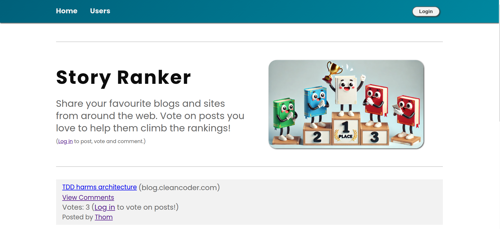

## 🏆 A full-stack, "Hacker News" inspired application that enables users to share, like, and comment on blog posts.

## Technologies Used

- **Frontend:** React, React Router, React Query, CSS Modules
- **Backend:** Node.js, Express.js
- **Database:** MongoDB with Mongoose
- **Authentication:** JWT Tokens

## Features

- **User Interaction:**

  - Create, edit, and delete blog posts.
  - Vote on posts with real-time updates via React Query.
  - Comment functionality with permissions to add and remove comments.

- **Authentication and Authorization:**

  - Secure user login using JWT authentication.
  - Role-based access control for critical actions like blog creation and deletion.

- **Frontend Development:**

  - Fully responsive design using CSS Modules and media queries.
  - Accessible UI leveraging semantic HTML (`<main>`, `<header>`) and ARIA attributes.
  - Efficient state management using React Context and custom hooks for user notifications and user state.

- **Backend API:**
  - RESTful API with clearly structured endpoints for managing blogs, users, and comments.
  - Schema-based modeling with MongoDB/Mongoose, handling complex data relationships effectively.

## Background

Originally inspired by a simplified blogging app created as part of the [Full Stack Open](https://fullstackopen.com/en/) course from the University of Helsinki, this project expands significantly on the original concept, incorporating more advanced features and technologies.

## Getting Started

### Installation

1. Clone the repository:

```bash
git clone https://github.com/ThomBator/blog-ranker-fullstack-app.git
```

2. Navigate to the project directory and install dependencies:

```bash
cd blog-ranker-fullstack-app
npm install
```

### Database Setup

Before running the app, ensure you have a local instance of MongoDB running. You will also need to create a `.env` file in the root directory with the following environment variables:

```env
MONGODB_URI=your_mongodb_connection_string
SECRET=your_jwt_secret
PORT=3001
```

Replace `your_mongodb_connection_string` with your actual local MongoDB URI, and `your_jwt_secret` with a secure secret key.

### Usage

1. Start the backend server from within ./blog-list-backend:

```bash
npm start
```

2. Start the frontend React application from within ./blog-list-frontend:

```bash
npm start


```
